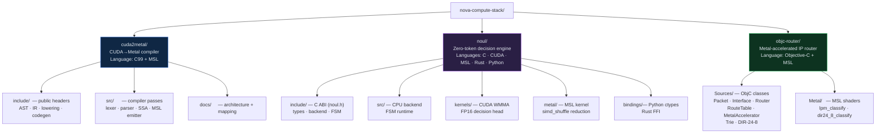
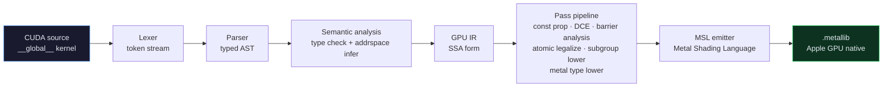
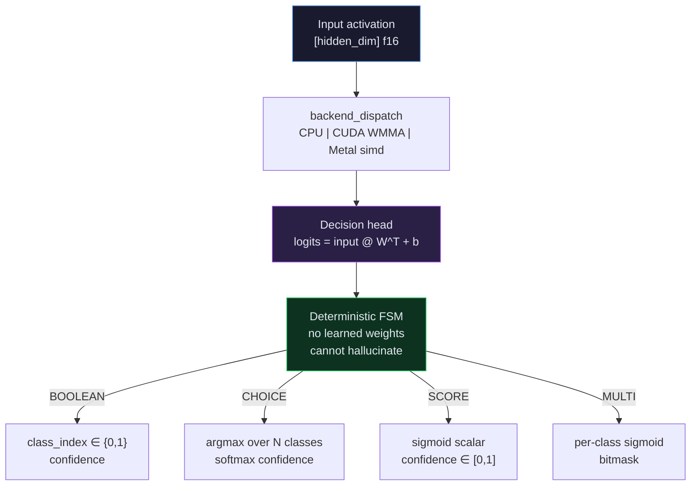
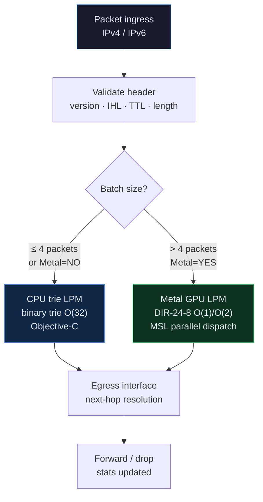
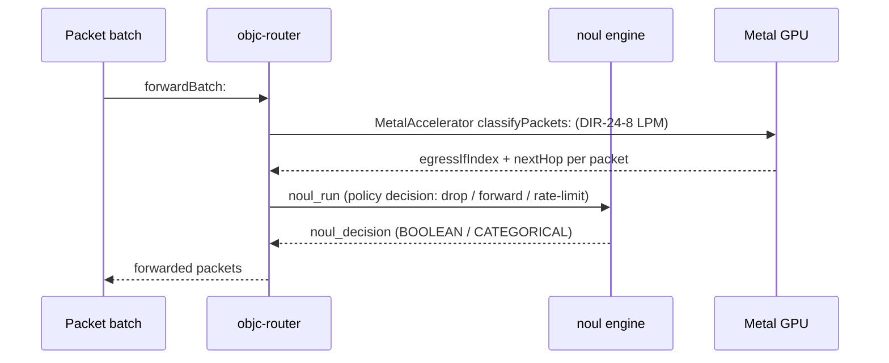

```
███╗   ██╗ ██████╗ ██╗   ██╗ █████╗      ██████╗ ██████╗ ███╗   ███╗██████╗ ██╗   ██╗████████╗███████╗
████╗  ██║██╔═══██╗██║   ██║██╔══██╗    ██╔════╝██╔═══██╗████╗ ████║██╔══██╗██║   ██║╚══██╔══╝██╔════╝
██╔██╗ ██║██║   ██║██║   ██║███████║    ██║     ██║   ██║██╔████╔██║██████╔╝██║   ██║   ██║   █████╗  
██║╚██╗██║██║   ██║╚██╗ ██╔╝██╔══██║    ██║     ██║   ██║██║╚██╔╝██║██╔═══╝ ██║   ██║   ██║   ██╔══╝  
██║ ╚████║╚██████╔╝ ╚████╔╝ ██║  ██║    ╚██████╗╚██████╔╝██║ ╚═╝ ██║██║     ╚██████╔╝   ██║   ███████╗
╚═╝  ╚═══╝ ╚═════╝   ╚═══╝  ╚═╝  ╚═╝     ╚═════╝ ╚═════╝ ╚═╝     ╚═╝╚═╝      ╚═════╝    ╚═╝   ╚══════╝

                             STACK
```

# nova-compute-stack


Four subsystems built by Nova Parr, collected in one monorepo:

1. **cuda2metal/** — A compiler that translates NVIDIA CUDA GPU code into Apple Metal GPU code. Not a regex find-and-replace — a full compiler with lexer, parser, typed AST, SSA IR, optimization passes, and Metal Shading Language output. If a CUDA construct can't be translated safely, it fails with a named error instead of producing wrong code.

2. **noul/** — A decision engine that plugs into any language model. Instead of generating text token-by-token, it takes the model's internal logit scores and produces a single typed decision (yes/no, pick-one-of-N, or a numeric score) in one pass. Runs on CPU, NVIDIA GPU (WMMA tensor cores), or Apple GPU (Metal simdgroup). Python and Rust bindings included.

3. **objc-router/** — A software IP packet router written in Objective-C with Metal GPU acceleration. Routes IPv4 packets using longest-prefix matching: small batches use a CPU binary trie, large batches get offloaded to the GPU via a DIR-24-8 lookup table for O(1) forwarding.

4. **metal-router/** — The production version of the router above. Adds full IPv6 support, IP/TCP/UDP checksum verification, fragment detection and drop policy, ARP+NDP neighbor cache with TTL aging, a text-based control plane (add/delete/show routes at runtime), a CPU-vs-GPU benchmark harness, real packet I/O via macOS utun, and a Network Extension skeleton for App Store deployment.

Each subsystem builds independently. No Python in the forwarding path. No NVIDIA emulation layer on Apple — native Metal throughout.

---

## What's in here



---

## 1. `cuda2metal/` — CUDA to Metal Translation Compiler

**Language:** C99 (compiler core) · MSL (generated output) · ObjC++ (Metal runtime)  
**What it does:** Full compiler pipeline — not a regex rewriter. CUDA source → lexer/parser → typed AST → SSA-based GPU IR → pass pipeline → MSL emission → `.metallib`.



**Key invariant:** If the compiler accepts a CUDA construct, the generated Metal program preserves the supported observable computational semantics. Silent approximation is forbidden — compilation fails with a named diagnostic (`C2M-041`, `C2M-070`, etc.).

| Construct | Mapping | Note |
|-----------|---------|------|
| `__global__` | `kernel` | Entry-point qualifier |
| `threadIdx.x` | `thread_position_in_threadgroup.x` | |
| `__shared__` | `threadgroup` | Address-space inference pass |
| `__syncthreads()` | `threadgroup_barrier(mem_flags::mem_threadgroup)` | `mem_none` is forbidden |
| `atomicAdd` | `atomic_fetch_add_explicit` | half→CAS emulation on Metal < 3.2 |
| `__shfl_sync` | `simd_shuffle` | Mask must be provably all-active |

---

## 2. `noul/` — Zero-Token Decision & Routing Engine

**Language:** C99 (core · FSM) · CUDA (WMMA kernel) · MSL (Metal kernel) · Rust FFI · Python ctypes  
**What it does:** Inverts the LLM pipeline. No text generation. Single forward pass through a constrained linear head → logits → deterministic FSM → typed `noul_decision`. O(1) passes, no autoregressive loop.



**Backends:**

| Backend | File | Hardware | Notes |
|---------|------|----------|-------|
| CPU | `src/noul.c` | Any | Deterministic hash mock — always compiles |
| CUDA WMMA | `kernels/cuda_backend.cu` | Ampere+ (sm_80) | FP16 input, FP32 accum, ~2µs launch |
| Metal | `metal/noul_decision.metal` | Apple Silicon | simd_shuffle warp reduction, zero-copy unified mem |

**FFI:** `bindings/noul.py` (ctypes) · `bindings/noul.rs` (unsafe FFI, `Drop` impl)

---

## 3. `objc-router/` — Metal-Accelerated IPv4/IPv6 Packet Router

**Language:** Objective-C (router logic) · MSL (GPU LPM kernels)  
**What it does:** Software IP router with two forwarding paths — CPU trie for single packets, Metal GPU for batches. DIR-24-8 two-level table for O(1)/O(2) longest-prefix matching at line rate on Apple GPU.



**LPM lookup comparison:**

| Method | Class | Lookup cost | GPU-uploadable |
|--------|-------|-------------|----------------|
| `RouteTable` (linear scan) | `RouteTable.m` | O(n) | Yes — flat `NSValue` array |
| Binary trie | `RouteTable.m` + `TrieNode` | O(32) | No |
| DIR-24-8 | `DIR24_8.h/.m` + `Shaders.metal` | O(1) prefix≤/24, O(2) longer | Yes — contiguous `NSData` |

**MSL shaders (`Metal/Shaders.metal`):**

| Kernel | Algorithm | Use |
|--------|-----------|-----|
| `lpm_classify` | Linear scan | Small tables, correctness reference |
| `dir24_8_classify` | DIR-24-8 two-level | Production — line-rate batches |

---

## 4. `metal-router/` — MetalRouter (Production Full Stack)

**Language:** Objective-C · MSL  
**What it does:** Production-grade dual-stack (IPv4/IPv6) software router. Superset of `objc-router/` — adds Checksum rewrite, Fragmentation drop, full NeighborCache (ARP+NDP with TTL aging), incremental DIRTables, ControlPlane text commands, Benchmark harness, utun real I/O, and Network Extension skeleton.

```
metal-router/
├── Sources/
│   ├── Packet.{h,m}            dual-stack, checksum rewrite in serialized
│   ├── Interface.{h,m}         IPv4 + IPv6 prefix matching
│   ├── RouteTable.{h,m}        binary trie IPv4 (O(32)) + IPv6 (O(128))
│   ├── TrieNode.{h,m}
│   ├── DIRTables.{h,m}         incremental DIR-24-8 + 16-bit IPv6 tables
│   ├── MetalAccelerator.{h,m}  DIR-24-8 GPU dispatch, embedded MSL fallback
│   ├── NeighborCache.{h,m}     ARP + NDP, TTL-based aging, IPv4 + IPv6
│   ├── Checksum.{h,m}          one's complement IP/TCP/UDP checksums
│   ├── Fragmentation.{h,m}     IPv4 fragment detection + drop policy
│   ├── Router.{h,m}            full forwarding: CPU + Metal + neighbor + frag
│   ├── UtunInterface.{h,m}     real packet I/O via macOS utun
│   ├── ControlPlane.{h,m}      text commands: add/del/show routes|stats|neighbors
│   ├── Benchmark.{h,m}         CPU trie vs Metal DIR timing harness
│   └── main.m
├── Shaders/Shaders.metal        dir24_8_classify kernel
└── NetworkExtension/
    └── PacketTunnelProvider.{h,m}   NEPacketTunnelProvider skeleton
```

### Routers compared

| | `objc-router/` | `metal-router/` |
|---|---|---|
| **Language** | Objective-C + MSL | Objective-C + MSL |
| **IPv6** | Partial | Full (trie + NDP cache) |
| **LPM data structure** | Linear scan / trie | Binary trie + incremental DIR-24-8 |
| **GPU batch threshold** | > 4 packets | > 8 packets |
| **Checksum rewrite** | No | Yes (IP header on forward) |
| **Fragmentation** | No | Drop non-first fragments |
| **Neighbor cache** | Header only | Full ARP+NDP with TTL aging |
| **Control plane** | None | Text commands (add/del/show) |
| **Benchmark harness** | No | Yes (CPU vs Metal Mpps) |
| **Real I/O** | No | utun + NEPacketTunnelProvider |

---

## Cross-subsystem: NOUL as the router's decision head



---

## Build

```bash
# cuda2metal (C99 core, no GPU required for compilation)
cd cuda2metal
cmake -B build && cmake --build build

# noul — CPU only
cd noul && make backend=cpu

# noul — CUDA (requires nvcc + Ampere GPU)
make backend=cuda

# noul — Metal (macOS only)
make backend=metal

# objc-router (macOS, Xcode toolchain)
cd objc-router
clang -fobjc-arc -framework Metal -framework Foundation \
      Sources/*.m -o router
```

---

## License

`cuda2metal`: MIT  
`noul`: Apache-2.0 OR MIT  
`objc-router`: MIT
